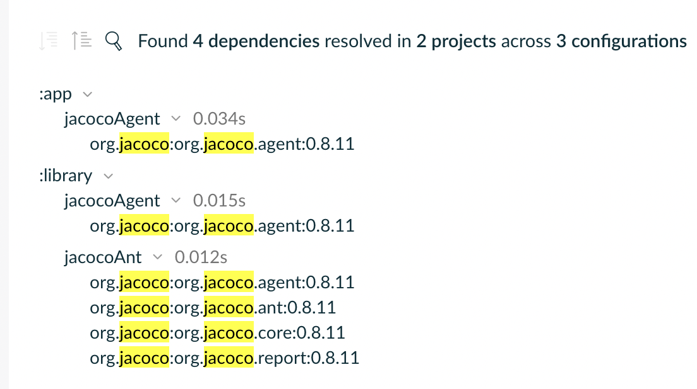
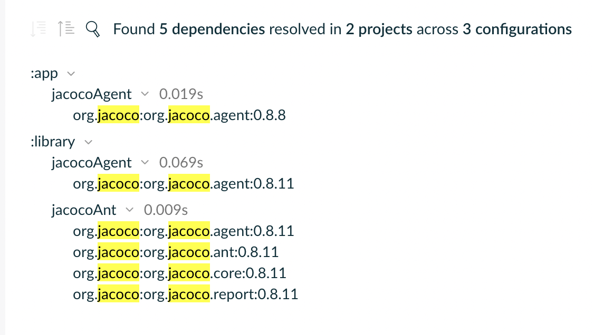

# Example project for AGP 8.2 forcing jacoco version 0.8.2

With Android Gradle Plugin version 8.2 is not possible to choose a jacoco version for the modules 
applying the `com.android.application` plugin and it always forces jacoco to use `0.8.8` regardless
of the configuration.

For example, by setting this in the root: 
`allprojects { plugins.withId("jacoco") { the<JacocoPluginExtension>().toolVersion = "0.8.11" } }`
The outcome from previous and current AGP versions is different.


AGP 8.1, try to force jacoco to version 0.8.11. Successful ✅
[Build scan](https://scans.gradle.com/s/xmnjluekuowyu/dependencies?dependencies=jacoco&expandAll)


AGP 8.2, try to force jacoco to version 0.8.11. Fails in Android modules. ❌
[Build scan](https://scans.gradle.com/s/iolijjm25pcqo/dependencies?dependencies=jacoco&expandAll).


### Why this is an issue?

Gradle 8.5 uses Jacoco agent `0.8.9` by default. If you have a multi-module structure and you are aggregating
all the reports together with a root agent, this agent will use the version `0.8.9` whereas all the
Android modules will generate reports with version `0.8.8`.

Currently, Jacoco version `0.8.9` to `0.8.10` are unable to merge reports generated with jacoco `0.8.8`.
See details in this [Jacoco issue](https://github.com/jacoco/jacoco/issues/1471). This issue is fixed
in Jacoco version `0.8.11` so the merge reports problem can be solved by adding the following lines in the root `build.gradle.kts` file.

```kotlin
jacoco {
    toolVersion = "0.8.11"
}
```

But regardless this specific issue, this prevents consumers of the Android plugin to decide their Jacoco version, 
which was not the previous behaviour.
